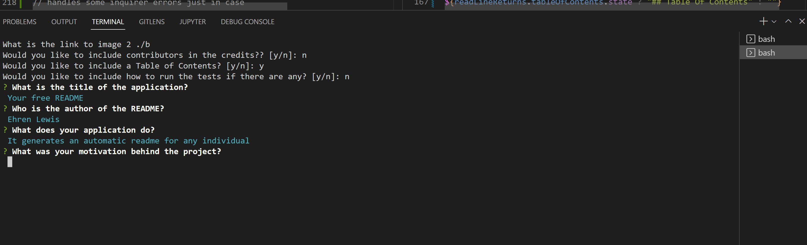

# AutoREADME

Author: Ehren Lewis

## Table Of Contents

* [About This Project](#about-this-project)
* [How to Install](#how-to-install)
* [Usage](#usage)
* [Known Issues](#known-issues)
* [Tests](#tests)
* [Questions](#questions)
* [License](#license)
* [Contributing](#contributing)

## About This Project

This application is a fully automated README generator that converts your directed inputs into a fully functioning markdown readme file. It allows for users to pick and choose certain aspects to either include in the readme, but those parts can also be left out if they so desire.

My motivation behind this application is that as a developer, I want to be able to spend more time working on my projects as I possibly can, so creating an automatic README generator will allow me to spend more time doing what I love, as well as doing it in a more efficient manner

For this application, I used JavaScript, Node to install packages, fs to write to a README file, Inquirer, and Readline-sync. I used both Readline-sync and Inquirer for two different reasons. Readline-sync allows for a more efficient way to handle dynamic sections of the readme geneartor since it isn't tied to a promise. Inquirer was better for a long stream of questions with how toe prompt system and chaining questions work with Inquirer, as well as having the return be a promise allowed for me to easily consolidate all of the data into one location to handle.

Some of the challenges faced was finding the proper information for the licenses, since the licenses are included inside the README and not their onw markdown file. Another challenge faces was formatting the strings, since tabs in a code editor will be coded into the README as well, it would cause the markdown to have improper structure. Finally, another challenge faced was the asynchronous ability of Inquirer. If I did want to ask a yes or no question, since it was aynchronous, the program would still run on the input needed though the promise was still pending, which allowed me to think outside the box for the answer.

## How to Install

    1. Navigate to the code repository
    2. Press the green code button, located near the about section
    3. Copy either the HTTPS, Git CLI, download the zip, open with GitHub desktop, or copy the SSH link.
    4. Depending on download method, use Git, executable, or the desktop application to open the content files.
    5. All of the content of the repository will be available after completion of the previous state.
    

## Usage

This application is designed to be used by software developers to increase their efficiency by not having to worry about having to build their README file from scratch. To use this application, follow the installtion process. Once installed, load the files in your text editor or through the command line. You will then be prompted, both dynamically and statically, for various topics pertaining what constitutes a README. A great example of this auto generator is this README, which was generated with it. Finally, once all prompts have been answered and the file name has been specified, the application will write to the file of your choice, finishing out a fully functional README

Link to the demo video: https://watch.screencastify.com/v/X5OEsGH26VMpPJCaY47p

## Known Issues

The current issues with this application is there is no save feature, any data will be deleted if the application is closed prematurely. Another issue is hitting the enter button too soon, which may cause for sections of the READMe you wanted populated to be incomplete before being able to manually change it later.

## Tests

There are currently no tests available to run with the application

## Questions

You can reach me at my Github: [Ehren-Lewis](https://github.com/Ehren-Lewis)

### OR

You can reach me at my [Ehren.Lewis@icloud.com](mailto:Ehren.Lewis@icloud.com) pertaining any other questions you may have

## License

MIT License

Copyright (c) 2022 [Ehren Lewis]

Permission is hereby granted, free of charge, to any person obtaining a copy
of this software and associated documentation files (the "Software"), to deal
in the Software without restriction, including without limitation the rights
to use, copy, modify, merge, publish, distribute, sublicense, and/or sell
copies of the Software, and to permit persons to whom the Software is
furnished to do so, subject to the following conditions:

The above copyright notice and this permission notice shall be included in all
copies or substantial portions of the Software.

THE SOFTWARE IS PROVIDED "AS IS", WITHOUT WARRANTY OF ANY KIND, EXPRESS OR
IMPLIED, INCLUDING BUT NOT LIMITED TO THE WARRANTIES OF MERCHANTABILITY,
FITNESS FOR A PARTICULAR PURPOSE AND NONINFRINGEMENT. IN NO EVENT SHALL THE
AUTHORS OR COPYRIGHT HOLDERS BE LIABLE FOR ANY CLAIM, DAMAGES OR OTHER
LIABILITY, WHETHER IN AN ACTION OF CONTRACT, TORT OR OTHERWISE, ARISING FROM,
OUT OF OR IN CONNECTION WITH THE SOFTWARE OR THE USE OR OTHER DEALINGS IN THE
SOFTWARE.

## Contributing

To contribute on this application, I can be reached via Github, LinkedIn, or by email.
